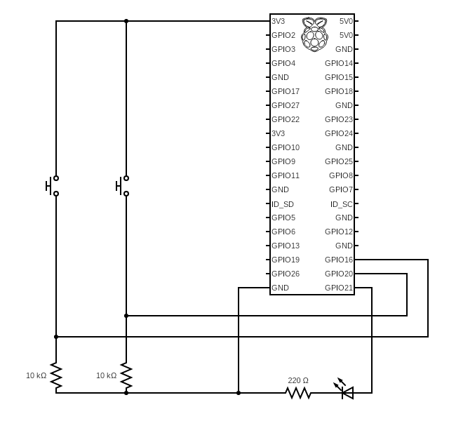

# ACCEL-BRAKE-SYSTEM

## 🚗 OverView
이 프로젝트는 라즈베리파이 4 를 이용한 간단한 자동차 엑셀레이터/브레이크 시스템 입니다.

다음을 시연해보기 위해 개발되었습니다:
- 상태 기반의 차량 컨트롤
- Fail-safe 메커니즘
- 전장 시스템 시뮬레이션

## ⚙️ Features
- 택틱 스위치를 이용한 엑셀레이터 / 브레이크 컨트롤
- 물리적인 방식으로 스피드 컨트롤
- 브레이크등 컨트롤
- 크리핑 현상 구현
- 비정상적인 상황에서의 Fail-safe 처리

## 요구 사항 명세
### 비즈니스 요구사항
- 엑셀과 브레이크를 이용하여 차량 제어 시스템을 만듭니다.
### 기능 요구사항
- [REQ-FUN-1] 엑셀레이터를 누르면 속도가 증가합니다.
- [REQ-FUN-2] 브레이크를 누르면 속도가 감소합니다. 
- [REQ-FUN-3] 브레이크를 누르고 있을 때, 브레이크등이 작동합니다.
- [REQ-FUN-4] 아무것도 누르고 있지 않을 때 크리핑 현상이 나타납니다.
### 비기능 요구사항
- [REQ-NON-1] 속도는 음수가 되지 않습니다.
- [REQ-NON-2] 최고 속력은 200km/h를 넘지 않습니다.
- [REQ-NON-3] 크리핑 현상은 5km/h를 넘지 않습니다.

## 회로도

스위치 두 개를 두어 하나는 가속, 하나는 감속을 의미하게 합니다.
각각은 Pull down 저항으로 연결하여 Active High를 유지하게 합니다.
Pull down 저항은 Pull up 저항에 비해 더욱 직관적이기 때문에 이번 프로젝트에서는 Pull down 저항을 사용하였습니다. \
또한, LED는 저항이 없이 연결할 경우 고장나기 쉽기 때문에 220옴 저항을 사용하였습니다.

